# Update a Companion from the phone (nRF52 Bluetooth or ESP32 Wi-Fi)

These are real screenshots from the Android 5.1.1 phone and two Full Companions on the Mercerwood Pi Zero bench: a RAK4631 (nRF52) and a Heltec V4.3 OLED (ESP32-S3). Use **Settings > Update Companion** on the phone. This updates the Companion the phone is directly connected to, not a remote repeater over LoRa.

**Test status:** The ESP32 update from `v1.17.1.5` to `v1.17.1.6` completed, the phone reconnected, and the app displayed the new version. The nRF52 Bluetooth DFU transfer reached 100%, and the radio booted the selected `v1.17.1.6` image as verified on its USB service port. Its phone-side reconnection after this lab downgrade was **not** verified: the older build requested Bluetooth pairing again. Do not treat the DFU completion screen alone as end-to-end proof. Details are at the end.

Keep the Companion powered and the phone charged. Choose an image for the **exact board and role** shown by the app. Do not use a repeater image for a Companion, or an image for a similarly named board. The examples below use the [MeshCore v1.17.1.6 release](https://github.com/mikecarper/MeshCore/releases/tag/v1.17.1.6-halo-keymind-cascade-dev-306feebe); normally select a release newer than the firmware already installed on *your* Companion. If the app's GitHub lookup is unavailable, download the exact release asset into the phone's Downloads and use **Phone Downloads** or **Browse files**. No command line is needed for the normal phone procedure.

## nRF52: Bluetooth DFU ZIP

1. Connect **directly over Bluetooth** to the nRF52 Companion. In **Settings > Update Companion**, check the board name. The RAK4631 test radio displays **RAK 4631** and **Nordic DFU .zip - Bluetooth update**. Expand **Installed firmware** to check its starting version.

   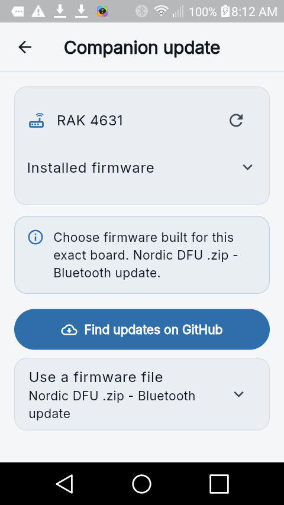

2. Choose a board-matched **application DFU `.zip`** from GitHub or the phone. For this test, the file name began `RAK_4631_companion_radio_full-`. The ZIP's manifest contained an `application` image only; it did not install a SoftDevice or bootloader. Do not extract the ZIP, choose a `.bin`, or assume an application ZIP can repair an incompatible bootloader. Confirm the app's selected-file card names the intended RAK 4631 package.

   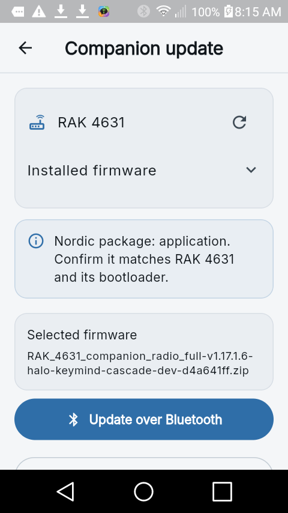

3. Tap **Update over Bluetooth** and read the confirmation. Check the board, package, and Bluetooth address. The app also shows the last reported battery voltage when it is above 0 V; the test radio reported 4.26 V. Keep the device powered and nearby, then tap **Update**.

   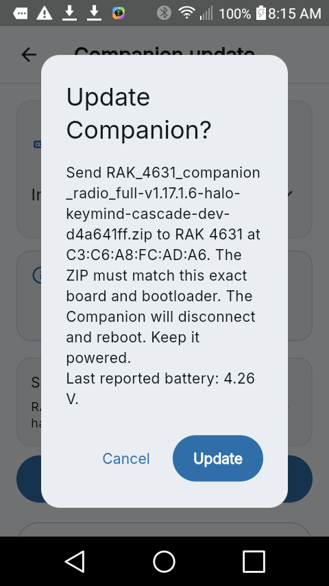

4. Wait for the transfer to reach 100%. Do not leave the app, disconnect Bluetooth, or remove power. If Android loses the bootloader connection, keep the radio powered and use the app's **Retry bootloader** control if offered.

   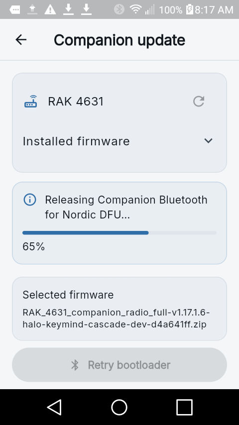

   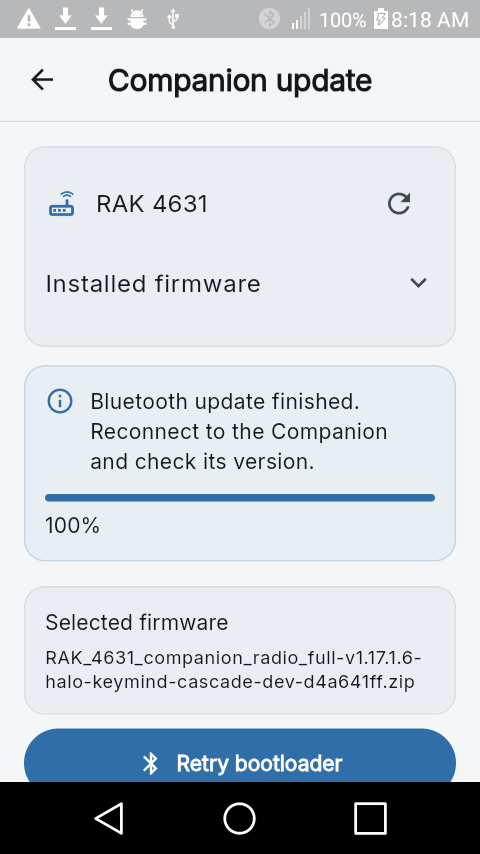

5. After the Companion reboots, use **Connect** and select the same radio in the scanner. If Android asks to pair again, use the PIN shown by your device or provided by its administrator; do not put the PIN into firmware files, screenshots, or this guide. Return to **Settings > Update Companion**, expand **Installed firmware**, and confirm the new version. A 100% DFU screen without this last check is not sufficient verification.

## ESP32: Wi-Fi application BIN

1. Connect to the ESP32 Companion, then open **Settings > Update Companion**. Check the exact board and the installed version. The test device reported **Heltec V4.3 OLED** and `v1.17.1.5`.

   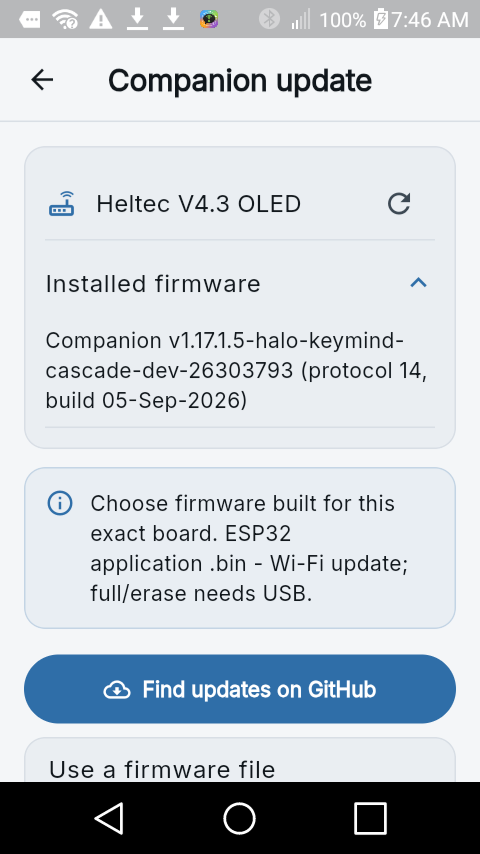

2. Select the matching **application `.bin`**, here `heltec_v4_2_v4_3_companion_radio_full_femon-...v1.17.1.6...bin`. Check the app's hardware match before proceeding. Do **not** use a merged, full-flash, or erase image for Wi-Fi OTA; those require a board-specific USB installation. The phone checks whether the application fits the radio's OTA slot before starting the updater. If it says partition expansion or USB preparation is required, stop and follow that separate procedure first; do not force the upload.

   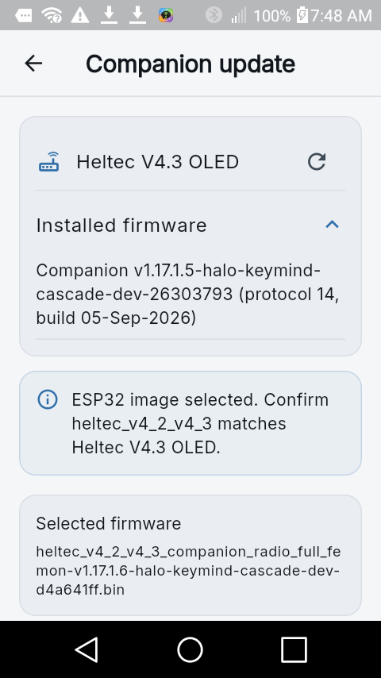

3. Tap **Start Wi-Fi updater**. The app starts the radio's lightweight updater and reports the OTA slot capacity. In this test it read a 6400 KB slot from the radio and accepted the selected image. The updater address shown here is local to the radio's temporary Wi-Fi network.

   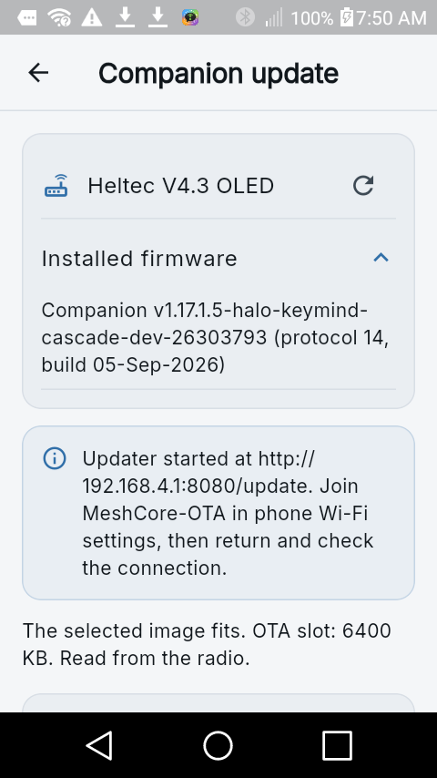

4. Tap **Open Wi-Fi settings** and join **MeshCore-OTA**. This lab updater advertised an open Wi-Fi network; do not assume every device uses the same security setting. Android may warn that the network has no Internet, or open a captive-portal page. That is expected for a local updater. Stay connected to **MeshCore-OTA**, then return to the app.

   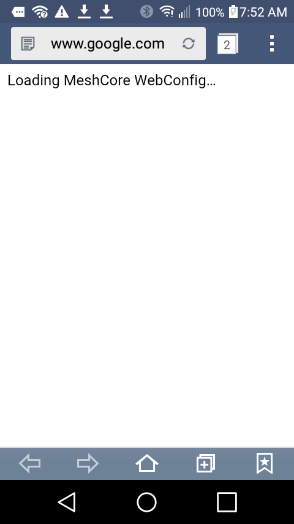

5. Tap **Check Wi-Fi connection**. Proceed only after the app says it is connected to the MeshCore lightweight updater. If the check fails, verify the phone is still on **MeshCore-OTA**, not its usual Wi-Fi or mobile data.

   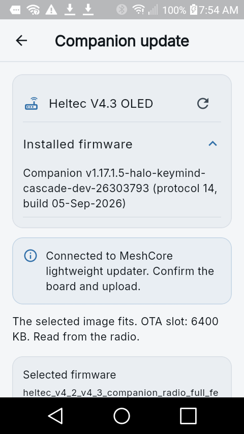

6. Tap **Upload firmware** and read the confirmation. It must name the same board, the intended application `.bin`, and a fitting OTA slot. Tap **Update**, keep the app open, and wait for **Upload accepted**. That message means the updater accepted the image; the reboot and installed version still need checking.

   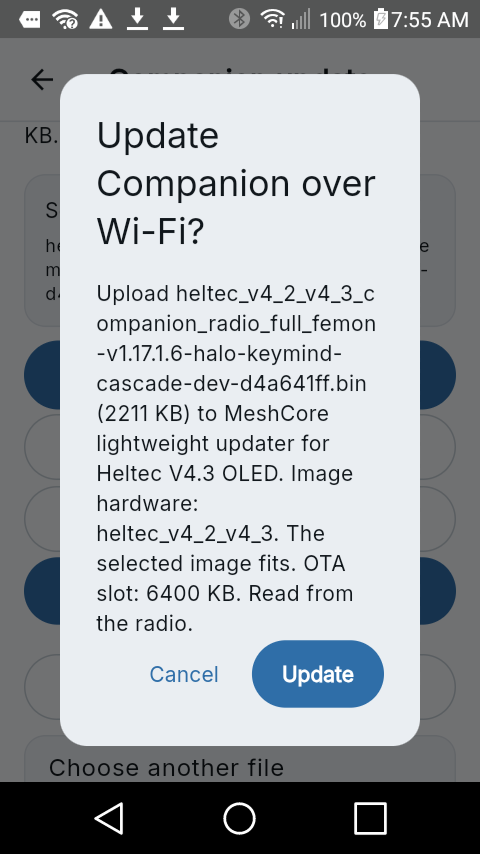

   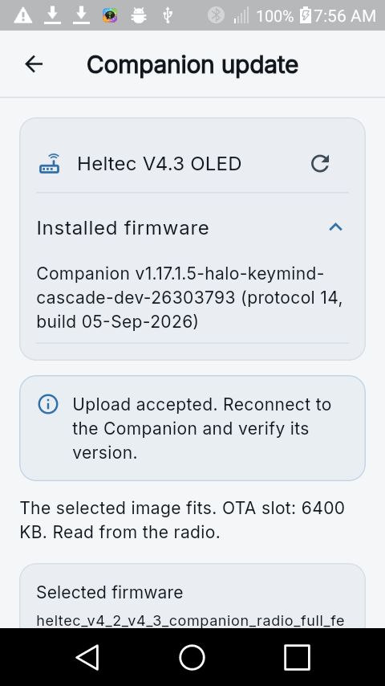

7. Let the radio reboot and reconnect to it. Return to **Settings > Update Companion** and expand **Installed firmware**. The Heltec V4.3 test radio then reported `v1.17.1.6-halo-keymind-cascade-dev-d4a641ff`, confirming the upgrade from `v1.17.1.5`. Rejoin your normal Wi-Fi network afterward if the phone does not switch back automatically.

   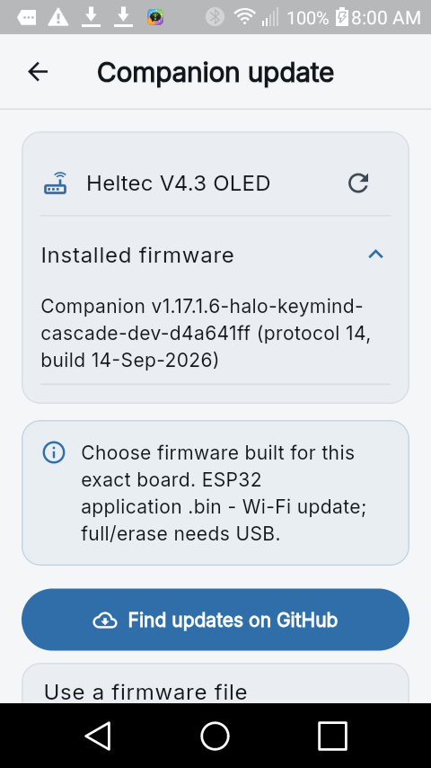

## What the bench test did and did not prove

The ESP32 screenshots show the complete phone procedure: both firmware versions, board and OTA-slot checks, local Wi-Fi connection, accepted upload, and post-reboot version verification. The `v1.17.1.5` baseline came from the [board-matched v1.17.1.5 release](https://github.com/mikecarper/MeshCore/releases/tag/v1.17.1.5-halo-keymind-cascade-dev-26303793), and the replacement came from the linked v1.17.1.6 release. The phone downloaded neither through an embedded secret; the files were placed in Downloads for this lab because the GitHub lookup on this Android 5.1.1 phone had previously failed DNS.

The nRF52 screenshots exercise a **lab downgrade** from a newer RAK4631 build to the v1.17.1.6 application ZIP to test Bluetooth DFU; they are not a recommendation to downgrade. The phone reported 100% and the Pi's USB service port reported `Companion v1.17.1.6-halo-keymind-cascade-dev-d4a641ff` after reboot. The older firmware could not initially save its Bluetooth PIN after the downgrade. Because this specific bench radio was designated erasable, its local file system was erased, a PIN was set again through the Pi service port, and it was rebooted. Even then, the Android 5.1.1 phone did not re-establish pairing during this run. That lab repair is **not** part of the normal phone tutorial, and the phone-side nRF52 final version check remains unverified. Do not erase a deployed radio merely because a DFU pairing attempt fails; preserve its data and diagnose the board, bootloader, PIN, and phone bond first.

The two update paths are distinct: nRF52 uses a board-matched **Nordic DFU ZIP over Bluetooth**; ESP32 uses a board-matched **application BIN over the radio's temporary Wi-Fi**. Neither path is the remote repeater [LoRa OTA procedure](LORA_OTA_REPEATER_TUTORIAL.md), and neither application update should be mistaken for a bootloader or partition-table installation.
