# Update a repeater over LoRa from the phone

This is a screenshot walkthrough of a real test on the Mercerwood Pi Zero mesh. The Android 5.1.1 phone was connected by Bluetooth to a RAK3401 Full Companion, which served the update over LoRa to a Heltec Tower V2 SD repeater. The repeater started on firmware `v1.17.1.5`; the selected replacement was `v1.17.1.6` for the **same** `Heltec_tower_v2_sdcard_repeater_lora_ota_no_external_sensors` target. The package manifest ID in these screenshots is `6BE07A6F`. Your manifest ID, board, radio settings, and timing will differ.

Keep the phone charging and the app in the foreground throughout the transfer. Use a legal frequency for your region. Do not use a package for a different board or storage layout. A bootloader update is a separate, higher-risk operation; this walkthrough updates the repeater application only.

## 1. Open the repeater's LoRa OTA screen

Connect the phone to a Full Companion over Bluetooth, open the **repeater** in Contacts, log in as its admin, then open **Repeater Management > LoRa OTA**. This is different from the nearby **ESP32 Wi-Fi update** and **nRF52 Bluetooth update** entries: the phone is using its companion as the LoRa source for a remote repeater.

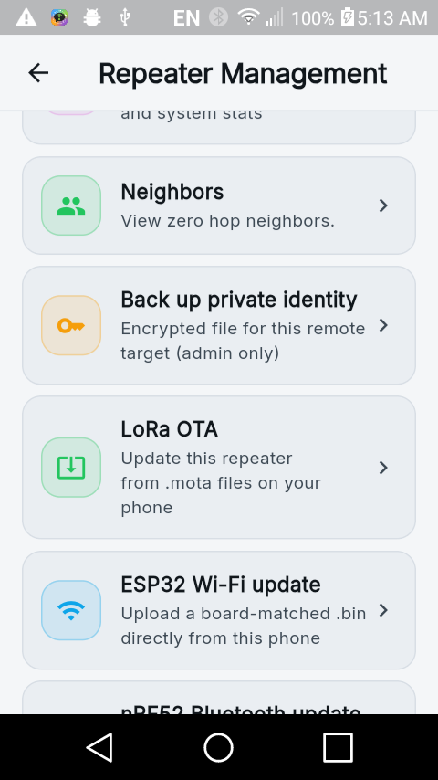

Check that the screen names the intended repeater and shows **Companion transport: Bluetooth** and **Encrypted mOTA channel: Ready**. If one of these checks is not green, resolve it before choosing firmware.

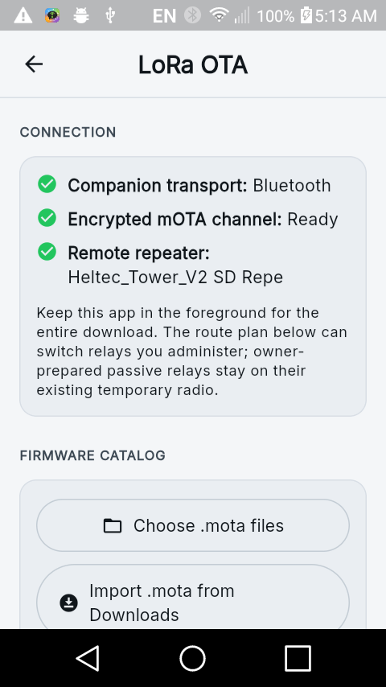

## 2. Get the exact firmware images onto the phone

For this test, the newer image came from the [board-matched MeshCore release](https://github.com/mikecarper/MeshCore/releases/tag/lora-ota-v1.17.1.6-halo-keymind-cascade-dev-306feebe). The release asset was a ZIP containing the application `.bin`. The phone builder takes the extracted `.bin`, **not** the ZIP. It also needs a `.bin` of the exact firmware already installed on the repeater; a merely similar version is not enough for an in-place delta. The app checks the installed firmware hash before it builds.

The **Find updates on GitHub** button is the easier path when the phone has working internet. On this test phone, GitHub DNS failed, so the matching release files were downloaded separately into the phone's Downloads and selected there. That network failure did not prevent local package generation or LoRa transfer.

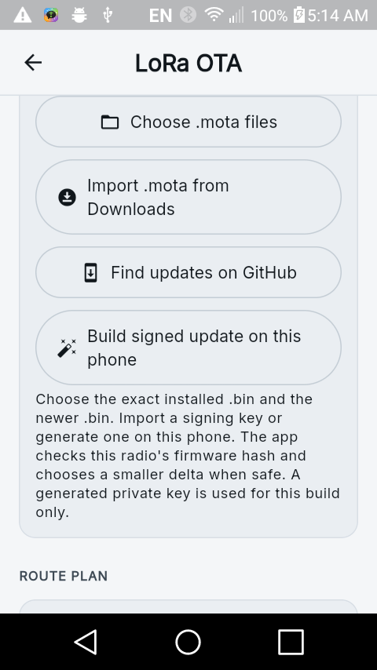

Tap **Build signed update on this phone**, choose the exact installed `.bin` first and the newer `.bin` second, then choose a signing key. In this test, **Generate on phone** created a one-update Ed25519 key and trusted its public half on the repeater. The generated private key is not saved; use an existing key file if you need to reuse or back up the signing identity. Never paste a private key or admin password into a screenshot or a repository.

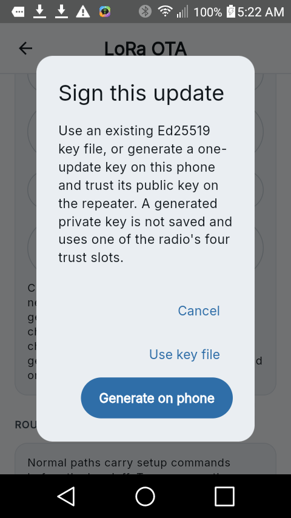

Wait for **1 verified file(s)** in the catalog. Here the phone selected a `detools in-place` package of about 491 KB. A delta is not guaranteed to be small; the builder chooses a safe codec for the actual base and replacement images. Note the manifest ID so you can match the discovered update and the repeater's download status later.

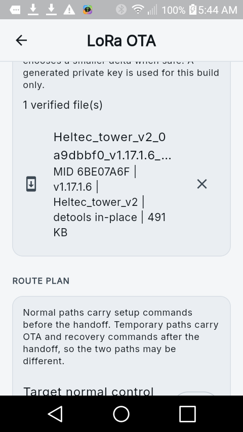

## 3. Set the route and temporary radio

The **normal control path** carries setup commands before the handoff. The **temporary OTA path** carries the transfer, status checks, and recovery after the radios switch. They may be different. Choose Direct (zero hops) only when the companion can actually reach the repeater directly; otherwise use the known hop path and include any controlled intermediate repeater that must switch channels. Do not guess a hop hash.

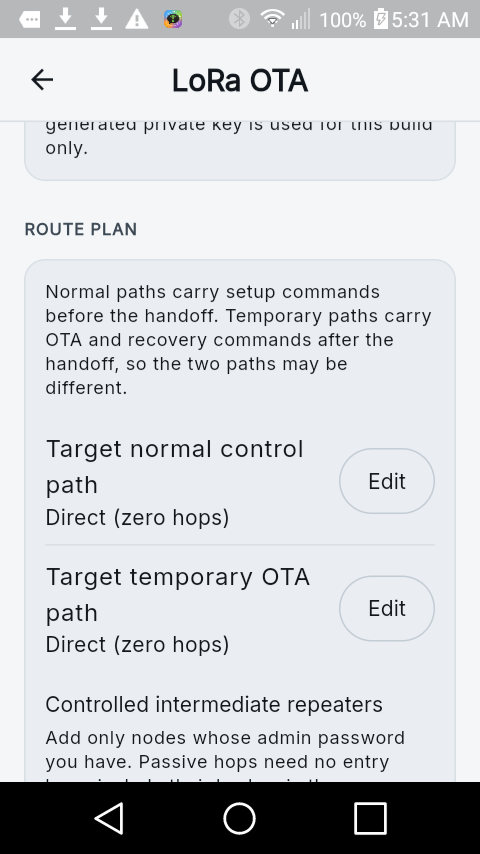

Choose a temporary radio profile both endpoints support. The Mercerwood test used 910.525 MHz, 250 kHz bandwidth, SF5, CR5, and a 120-minute window; **these values are an example, not a universal preset**. The app runs a three-minute reachability test before extending the window and starting the source. Leave enough time for a large transfer and its verification.

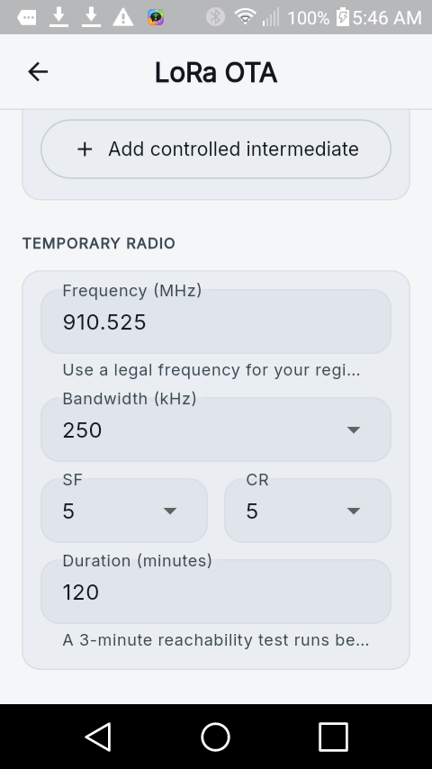

Tap **Test radios and start source**. Do not proceed until the session says the channel is ready, the source is attached, and it is advertising the expected number of files. The initial packet count can be small; it is not a download percentage.

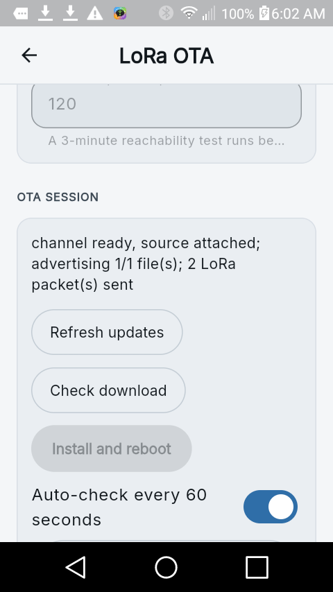

## 4. Discover and download the update

Tap **Refresh updates**. Discovery is asynchronous, so an initial "No updates seen yet" is normal. In this test, a second refresh found `6BE07A6F v1.17.1.6 delta [same target]`. Check the manifest ID, version, and **same target** label before pulling.

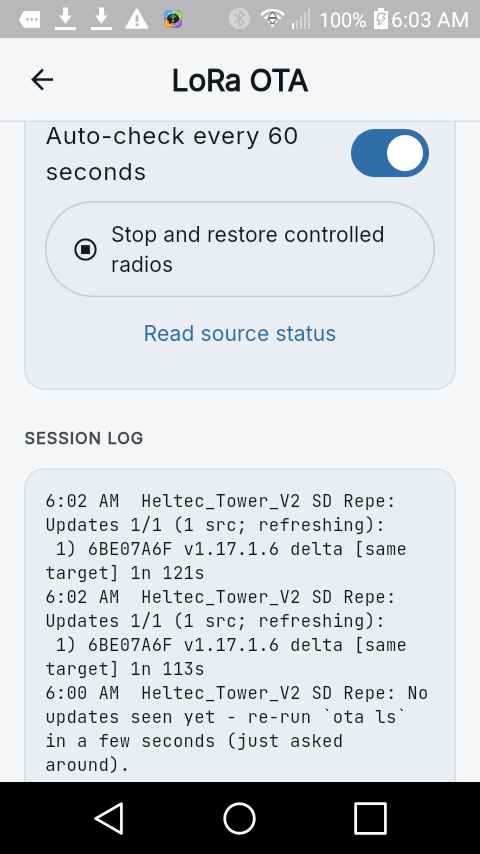

Scroll back to the verified file in the firmware catalog, tap **Pull**, then **Start download**. This stages the package on the repeater; it does not install or reboot it.

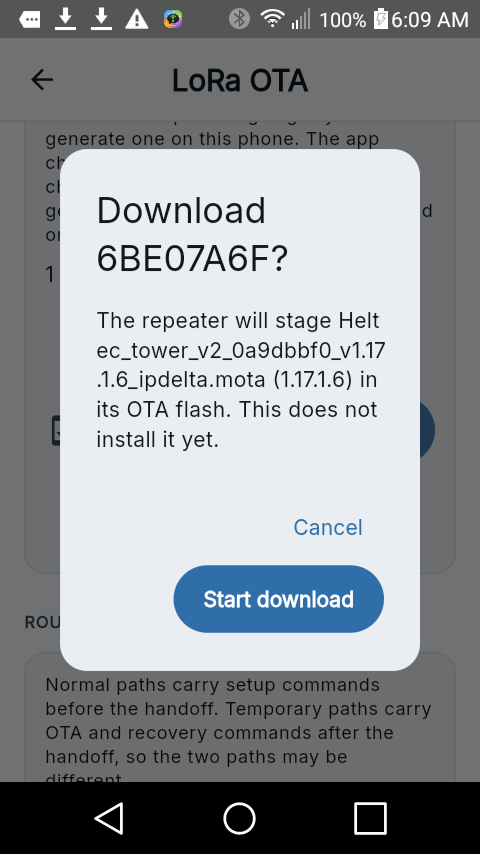

Keep the app in the foreground. Use **Check download** for target-side progress; the source's "LoRa packets sent" counter only proves that it is transmitting. Wait for the target to say **ready to install** before proceeding.

**If the start reply times out, do not immediately tap Pull again.** The command may have reached the target even though its reply was lost. On this test, the phone showed a 20-second command timeout, but a read-only check on the repeater showed `downloading 63/489 (12%) id=6BE07A6F`, and the count kept increasing. Repeating Pull can reset or resume the fetch session. First check target status after traffic settles; use a service connection only if the phone cannot get a reply.

## 5. Install and verify

After **Check download** reports **ready to install** for the same manifest ID, tap **Install and reboot** and read its confirmation. The repeater rechecks the signed package and installs it only if the board, base hash, codec, bootloader capability, and integrity checks pass. Keep the phone and companion available until the repeater returns. Reconnect if needed, then use **Verify installed update** or the repeater's installed-firmware view to confirm the new version. Finally use **Stop and restore controlled radios**; also verify any temporary relay and power-saving radio configuration returned to their normal settings.

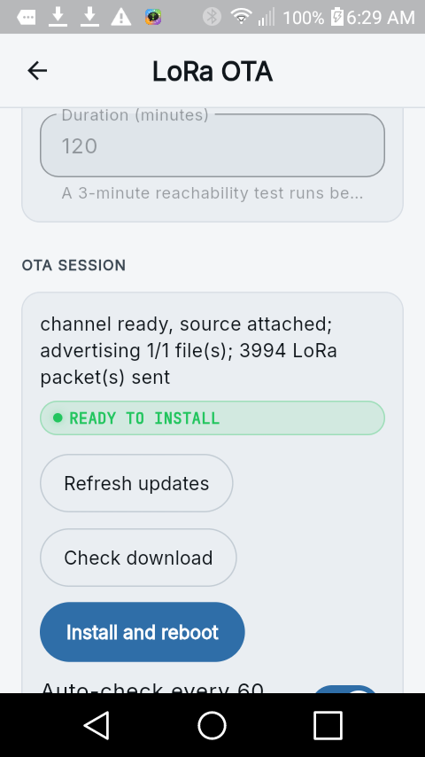

The [MeshCore OTA user guide](https://github.com/mikecarper/MeshCore/blob/main/docs/ota_user_guide.md) explains the underlying catalog, staging, and install states in more depth.

## What was special about this lab run

These screenshots are from the phone, not mockups. The Pi Zero's USB serial ports were used for target diagnostics and, before the successful run, to place the two test radios on the same temporary channel. This was necessary because the target's normal one-hop path worked for preflight but its direct normal-radio handoff timed out. Normally the app should perform the handoff itself. That manual pre-alignment is **not** part of the phone-only procedure above and should not be attempted on an unprepared mesh.

The target completed all `489/489` blocks and reported **ready to install**. The APK used for the screenshots had a lost-reply bug: after the Pull response timed out, its install button did not remember which verified catalog file matched the staged manifest. That was corrected in the app source and covered by a regression test, but the in-flight APK could not be replaced without losing its in-memory signing package. For this one lab run, installation was therefore triggered through the Pi service port rather than the phone. The repeater rebooted and reported `v1.17.1.6-halo-keymind-cascade-dev-306feebe`; both radios returned to their normal 910.525 MHz / 62.5 kHz / SF7 / CR5 profile, and the repeater's RX power-saving level 8 / preamble 16 was restored. **The phone's final Install action remains unverified on the physical repeater in this run.** The test radios were designated as erasable by their owner; do not assume that for other devices.
